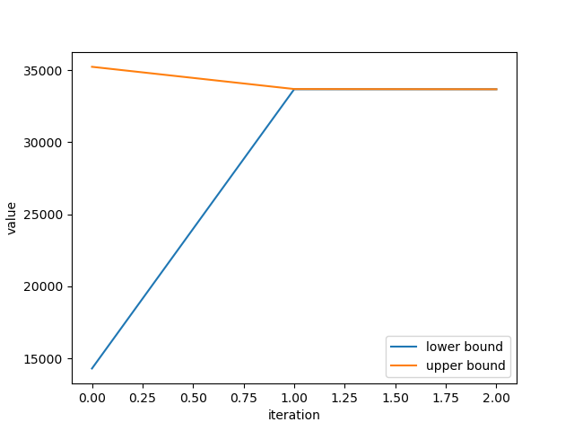
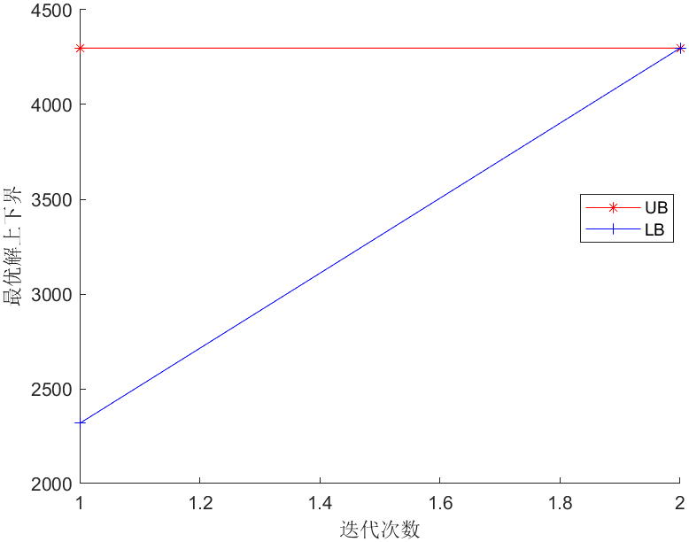

# Implementation of two-stage robust optimization algorithm for C&CG

---

This is an implementation of the two-stage robust optimization algorithm for C&CG. This project mainly contains two parts:

- Implementation of the C&CG algorithm based on [1].
- Application of the C&CG to two-stage robust optimization of economic dispatch of Microgrid based on [2].

## Files Include

---

1. `CCG_kkt.py`:  use KKT conditions to solve the C&CG sub-problem.
2. `CCG_dual.py`:  use dual method to solve the C&CG sub-problem.
3. `Microgrid_CCG_dual.m`: application of C&CG algorithm to two-stage robust economic dispatch of Microgrid.

## Must include packages

---

- All files are calling [GUROBI](www.gurobi.com) solve. So please make sure you have installed GUROBI first.
- File 1 and 2 use GUROBI Python API. So make sure you have installed `gurobipy` first. It is very easy by using following commands:

``` Python
pip install gurobipy
```

or if you are using Anaconda, you can use following commands:

``` Python
conda install -c gurobi gurobi
```

- `NumPy` and `Matplotlib` are used to plot the results.
- File 3 uses [YALMIP](www.gurobi.com).

## To be updated/some issues

---

- File 1 and 2 need 3 times iterations to solve the problem while the original thesis only needs 2 times. I still haven't figure out why.
- I failed to use KKT conditions to implement the Microgrid economic dispatch problem.

## CCG results
---

Here are the convergence results of two cases. Other results can be found in the `CCG` and `Microgrid` folders.





## References

---
[1] Zeng, Bo, and Long Zhao. "Solving two-stage robust optimization problems using a column-and-constraint generation method." Operations Research Letters 41, no. 5 (2013): 457-461.
[2] 刘一欣,郭力,王成山.微电网两阶段鲁棒优化经济调度方法[J].中国电机工程学报,2018,38(14):4013-4022+4307.DOI:10.13334/j.0258-8013.pcsee.170500.
